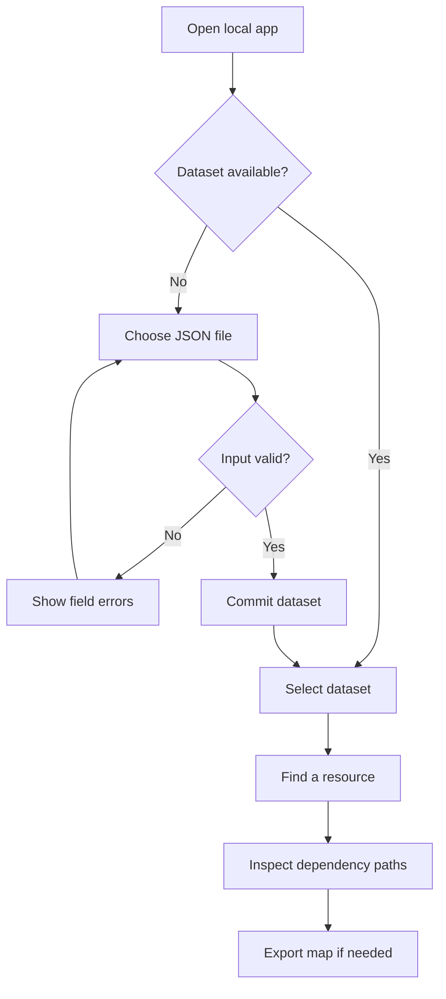
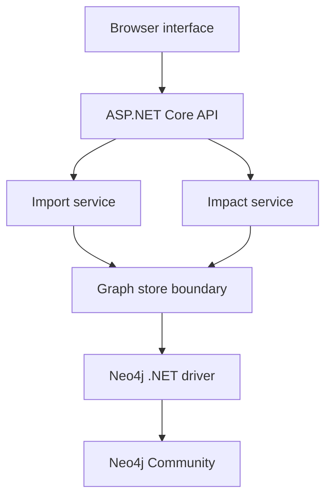
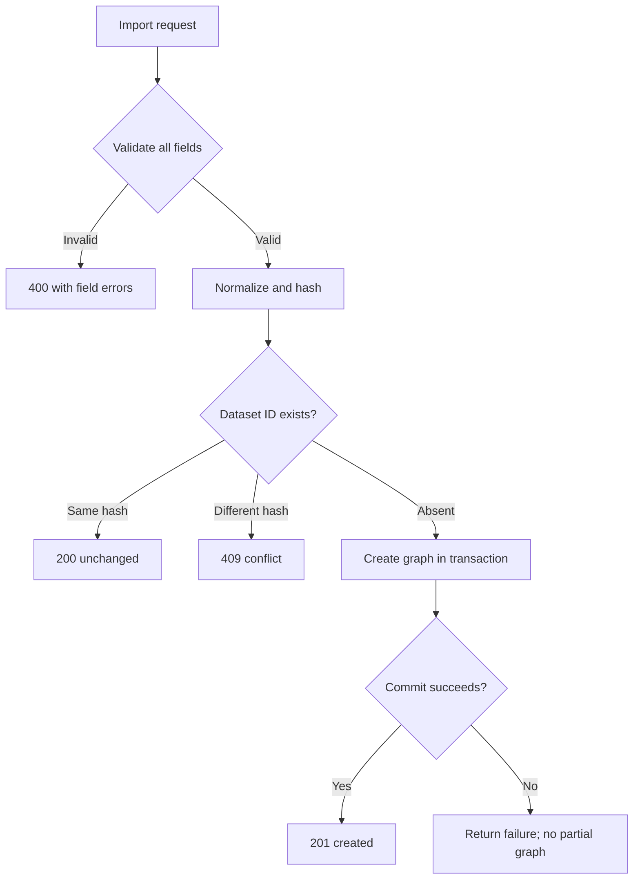

# RippleMap: project and system flow

This document describes version 0.1, the local single-user prototype. The contracts and limits are defined in [03-DATA-AND-API.md](03-DATA-AND-API.md).

## The user journey

A developer opens RippleMap locally, imports a JSON description of a system, selects a resource, and reads the resources that depend on it. Every result includes an explanatory path. The user can export the map to keep it under version control.

No account or company onboarding is built during week one. This reduces scope but also limits deployment: the prototype stays on the developer's machine.

## What runs where

The browser displays information and sends HTTP requests. It cannot connect directly to the graph database. The API holds database credentials in configuration outside committed source.

The application services decide use-case behaviour. The store implements graph persistence and querying. The driver is the library that communicates with Neo4j. Keeping these responsibilities separate makes failures easier to locate and tests easier to write.

These are logical boundaries inside one application. They are not independently deployed services.

## Import flow, step by step

1. The browser reads the selected JSON file and sends its contents with Content-Type application/json.
2. The server applies its body-size limit. The browser's file picker is not a security boundary.
3. JSON deserialisation converts text into request objects.
4. The validator checks schema version, counts, resource IDs, kinds, field lengths, relationship endpoints, and timestamps.
5. The normaliser sorts resources and relationships into a consistent order, trims display values, and normalises timestamps.
6. The application computes a SHA-256 content hash from the normalised request, excluding server-generated metadata.
7. The graph store checks the dataset ID.
8. If the ID exists with the same hash, the server returns unchanged. If it exists with a different hash, the server returns a conflict.
9. Otherwise, a single database transaction creates the dataset node, all resource nodes, and all dependency relationships.
10. The server returns success only after the transaction commits.
11. The interface refreshes the dataset list and displays the imported counts.

The unique dataset constraint resolves races. If two requests try to create the same ID simultaneously, one may lose the race. Re-read the existing hash after the conflict and classify it as unchanged or conflicting content. Do not ignore all database errors or assume every failure is a duplicate.

## Why datasets are immutable in version 0.1

A dataset is one complete snapshot, identified by a name such as demo-v1. Its contents do not change after successful import.

To try a changed map, import a new ID such as demo-v2. The original remains available. This avoids partial updates, deletion conflicts, and mixed versions while we are learning.

Identical imports are safe to repeat. Different content under the same ID is rejected. There is no replace, merge, patch, or delete endpoint in week one.

This is a deliberate scope choice. The later version can implement controlled replacement or richer version histories when the necessary tests exist.

## Impact-query flow

1. The user chooses a dataset and target resource.
2. The browser requests the impact endpoint with a maximum traversal depth.
3. The API validates the depth and identifiers.
4. The application confirms that both the dataset and target exist.
5. The store runs a parameterised Cypher query following incoming dependency paths.
6. The query stays within the dataset, excludes repeated nodes in a path, and applies its configured timeout.
7. The store fetches up to 101 paths. The API returns at most 100 and uses the extra result to signal that the result cap was reached.
8. The application groups the returned starting resources and maps database values into API response objects.
9. The interface displays the paths, the depth limit, and any result-cap warning.

For a relationship A DEPENDS_ON B, selecting B finds A. Selecting A must not automatically claim B is affected by A. Direction matters.

An empty result means no matching recorded paths were found within the selected depth. It does not prove that the real system has no dependencies.

If the query times out, return a clear failure. Do not return an empty success response or silently pretend a partial result is complete.

## Example walkthrough

The canonical map has six resources and five relationships:

- web-app depends on checkout.
- mobile-app depends on checkout.
- checkout depends on payment-provider.
- checkout depends on orders-db.
- refunds depends on payment-provider.

Selecting payment-provider at depth 1 returns checkout and refunds. At depth 2 or greater, web-app and mobile-app also appear. Orders-db does not appear because it is another dependency of checkout, not a resource that depends on the payment provider.

This is the first acceptance test for direction and transitive reasoning.

## Clean code and dependency direction

The proposed API project has these responsibilities:

| Location | Purpose | Example |
| --- | --- | --- |
| Contracts | HTTP request and response shapes | ImportMapRequest, ImpactResponse |
| Features/Imports | Validation, normalisation, import use case | ImportService |
| Features/Impact | Depth checks, result grouping, impact use case | ImpactService |
| Infrastructure/Neo4j | Queries, transactions, driver result mapping | Neo4jGraphStore |
| Controllers | HTTP input, status codes, response mapping | ImportsController |
| wwwroot | Local browser interface | index.html, app.js, styles.css |

The application services depend on a small IGraphStore interface describing the operations they require. Neo4jGraphStore implements it. Program.cs connects the implementation through dependency injection.

The interface is a useful boundary because application rules can be tested independently and real persistence behaviour has separate integration tests. Avoid creating an interface for every data object.

## Failure behaviour is part of the flow

| Failure | Expected behaviour |
| --- | --- |
| Malformed JSON | 400 response with an understandable parsing error |
| Unknown resource referenced by an edge | 400 with the relationship location and missing ID |
| Same dataset ID with different content | 409; preserve existing graph |
| Neo4j unavailable during import | 503; no successful import claim |
| Query deadline exceeded | 504 with query_timed_out; no complete-results claim |
| Browser refresh | Previously committed datasets remain available |
| Application restarts | Data remains in the persistent Neo4j volume |
| Application loses the success response | Repeating the same import returns unchanged after its prior commit |
| HTML-like resource name | Display it as plain text |
| Cycle in the graph | Bounded traversal returns without endless recursion |

## What the system does not infer

It does not inspect arbitrary source code to discover service calls. It does not establish that a package is vulnerable. It does not prove that an outage will propagate. It does not validate a resource by contacting its URL.

Those capabilities require new data sources and new trust decisions. The first version operates on explicit declarations so that every result is explainable.

## Operational flow

Start the database with a persistent volume. Start the API with its server-side database configuration. Open the API's local address in the browser. Readiness checks verify database connectivity; a separate liveness endpoint only verifies that the application process can respond.

A Docker Compose database configuration can simplify setup. Application containerisation is optional during this sprint if it endangers the core acceptance tests. Either route must document ports, configuration, and how data persists.

